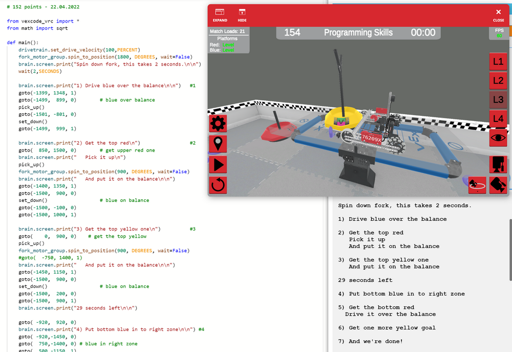

# VEX History

This repository started in September 2021 to document the virtual skills of team 76209 at SSIS, since all teaching was done online due to the ongoing Covid-19 pandemic. Until the end of 2022 no team was allowed to travel, so even a year later we could not visit Taipei for the Signature Event. But by summer 2023 all restrictions were virtually gone, so this repository turned into a little history of VEX at SSIS and in Vietnam. For season 2024-2025 High Stakes there are 4 teams to represent Vietnam at the V5RC World Championship in Dallas, like the year before. Here is a list:

- 2025 High Stakes 1x MS, 3x HS:
- 2024 [Over Under](https://www.robotevents.com/robot-competitions/vex-robotics-competition/RE-VRC-23-3691.html#general-info) 1x MS: [36070A](https://www.robotevents.com/teams/V5RC/36070A) PENN APPLE JUICE, 3x [High School](https://www.robotevents.com/robot-competitions/vex-robotics-competition/RE-VRC-23-3690.html#general-info): [36070M](https://www.robotevents.com/teams/V5RC/36070M) 11, [36070J](https://www.robotevents.com/teams/V5RC/36070J) LSTS FATE, [36070F](https://www.robotevents.com/teams/V5RC/36070F) PENN MÌ Ý
- 2023 [Spin Up](https://www.robotevents.com/robot-competitions/vex-robotics-competition/RE-VRC-22-9726.html#general-info) 1x Middle School: [76209M](https://www.robotevents.com/teams/V5RC/76209M) Mission Impossible , 1x High School: [76209R](https://www.robotevents.com/teams/V5RC/76209R) Raccoons
- 2022 Tipping Point (Covid-19)
- 2021 Change-Up (Covid-19)
- 2020 [Tower Takeover](https://www.robotevents.com/robot-competitions/vex-robotics-competition/RE-VRC-19-8379.html#general-info) 1x High school: [76209G](https://www.robotevents.com/teams/V5RC/76209G)
- 2019 [Turning Point](https://www.robotevents.com/robot-competitions/vex-robotics-competition/RE-VRC-18-6082.html#general-info) 1x High School: [76209X](https://www.robotevents.com/teams/V5RC/76209X)
- 2018 [In the Zone](https://www.robotevents.com/robot-competitions/vex-robotics-competition/RE-VRC-17-3805.html#general-info) 1x High School: [76209G](https://www.robotevents.com/teams/V5RC/76209G)

## VEX at SSIS for 2021-2022 Tipping Point

[](https://GitHub.com/kreier/vex/releases/)
[](https://kreier.mit-license.org/)

Programs for team 76209 of the SSIS Dragons. Code, functions and highscores constantly improve. The online competition website is https://codev5.vex.com/

The standing for the virtual teams is online at:

https://www.robotevents.com/robot-competitions/vex-robotics-competition/virtualSkillsStandings

Coordinates and directions with the GPS sensor are documented in this [knowledgebase article](https://kb.vex.com/hc/en-us/articles/360061375711-Identifying-Location-Details-in-VRC-Virtual-Skills) from VEX: 

https://kb.vex.com/hc/en-us/articles/360061375711-Identifying-Location-Details-in-VRC-Virtual-Skills

## Highscore

- 09/27/2021 43 points
- 10/08/2021 96 points
- 11/01/2021 102 points
- 11/06/2021 111 points
- 11/08/2021 130 points with comments and some structured code
- 12/10/2021 130 points in 30 seconds, new `goto` function, 60 lines
- 04/13/2022 130 points in 30 seconds, but only 42 lines, less code by using an array
- 04/22/2022 154 points with both platforms leveled, robot on one platform too



## Compact Code April 2022

``` py
# 130 points - 41 lines - 30 seconds - 15.04.2022
from vexcode_vrc import *
from math import sqrt
path = [[-920,  920, 0],[-920,-1450, 0],[750, -1400, 0],[ 500,-1150, 1],[-600, -710, 0],
        [ 400, -250, 1],[   0,    0, 0],[-600,  200, 0],[ 400,  400, 1],[   0,  950, 0],
        [-600,  950, 0],[ 920,  950, 1],[ 920, 1500, 0],[-600, 1320, 0],[ 600,  600, 1],
        [ 600, -600, 1],[1400,-1350, 1],[1500, -900, 0]]
def goto(target_x, target_y, reverse):
    x1 = gps.x_position(MM)
    y1 = gps.y_position(MM)
    delta_x = target_x - x1
    delta_y = target_y - y1
    direction_fr = FORWARD          # direction either FORWARD or REVERSE fr
    distance = math.sqrt(delta_x**2 + delta_y**2)     # pythagorean theorem
    if ( delta_x == 0 ):            # can't divide by zero, vertical motion
        direction = 90              # standard: drive upwards
        if ( delta_y > 0):
            direction = 270         # otherwise downwards
    else:
        direction = - math.atan(delta_y / delta_x) * 180 / math.pi
    if ( delta_x < 0 ):             # atan range is [-180|180] but need [0|360] 
        direction += 180
    if ( reverse is 1 ):            # driving reverse in opposite direction
        direction += 180
        direction_fr = REVERSE
    direction = direction % 360     # with the modulo % operator, range < 360 
    drivetrain.turn_to_heading(direction, DEGREES, wait=True)   # (1) DIRECTION
    drivetrain.drive_for(direction_fr, distance, MM, wait=True) # (2) DRIVING
def pick_up():
    fork_motor_group.spin_to_position(1500, DEGREES, wait=True)
def set_down():
    fork_motor_group.spin_to_position(1800, DEGREES, wait=True)
def main():
    drivetrain.set_drive_velocity(100, PERCENT)
    fork_motor_group.spin_to_position(1800, DEGREES, wait=False)
    for x, y, r in path:            # loop for all coordinates in path array
        goto(x, y, r)
    pick_up() 
    goto( 1500,  100, 0)
    stop_project()
vr_thread(main)
```
## Improved goto function - May 2022

``` py
def goto(target_x, target_y, reverse):
    x1 = gps.x_position(MM)
    y1 = gps.y_position(MM)
    d1 = gps.heading()              # gives angle 0-360 degrees, 0 is north
    brain.screen.print("{:.0f}|{:.0f} to {:.0f}|{:.0f} ".format(x1, y1, target_x, target_y))
    delta_x = target_x - x1
    delta_y = target_y - y1
    direction_fr = FORWARD          # direction either FORWARD or REVERSE fr -  or GLUE (2)
    distance = math.sqrt(delta_x**2 + delta_y**2)     # pythagorean theorem
    brain.screen.print("delta {:.0f}|{:.0f} > {:.0f}\n".format(delta_x, delta_y, distance))
    if ( delta_y == 0 ):            # can't divide by zero, horizontal motion
        direction = 90              # standard: drive to the right
        if ( delta_x < 0):
            direction = 270         # otherwise drive to the left
    else:
        direction = math.atan(delta_x / delta_y) * 180 / math.pi
    if ( delta_y < 0 ):             # atan range is [-180|180], but we need [0|360] 
        direction += 180
    if ( reverse is 1 ):            # driving reverse in oposite calculated direction
        direction += 180
        direction_fr = REVERSE
    if ( reverse is 2 ):            # special "glue" mode, driving backwards with forwards
        distance = distance * (-1)  # using a negative distance
        direction += 180
    direction = direction % 360     # with the modulo % operator, range < 360 degrees
    turn_degrees = direction - d1
    if(turn_degrees > 180):
        turn_degrees -= 360
    if(turn_degrees < -180):
        turn_degrees += 360
    brain.screen.print("Direction: {:.0f}|{:.0f} > {:.0f} \n".format(d1, direction, turn_degrees))
    drivetrain.turn_for(RIGHT, turn_degrees, DEGREES)
#    drivetrain.turn_to_heading(direction, DEGREES, wait=True)
    drivetrain.drive_for(direction_fr, int(distance), MM, wait=True)
```


## Historic code

Created December 10th. With the new `goto( x-coordinate, y-coordinate, reverse)` function, using GPS and trigonometry. 

``` py
# 130 points - 60 lines - 30 seconds - 09.12.2021
from vexcode_vrc import *
from math import sqrt

def main():
    drivetrain.set_drive_velocity(100,PERCENT)
    fork_motor_group.spin_to_position(1800, DEGREES, wait=False)
    goto( -920,  920, 0)
    goto( -920,-1450, 0)
    goto(  750,-1400, 0) # blue in right zone
    goto(  500,-1150, 1)
#   goto(    0, -950, 0) # m = - 2/5
    goto( -600, -710, 0) # yellow in left zone
    goto(  400, -250, 1)
    goto(    0,    0, 0) # m = - 5/8
    goto( -600,  200, 0) # yellow in left zone
    goto(  400,  400, 1)
    goto(    0,  950, 0)
    goto( -600,  950, 0) # yellow in left zone
    goto(  920,  950, 1)
    goto(  920, 1500, 0)
    goto( -600, 1320, 0) # red in left zone
    goto(  600,  600, 1)
    goto(  600, -600, 1)
    goto( 1400,-1350, 1)
    goto( 1500, -900, 0) # red on balance
    pick_up() 
    goto( 1500,  100, 0)
    stop_project()

def goto(target_x, target_y, reverse):
    x1 = gps.x_position(MM)
    y1 = gps.y_position(MM)
    delta_x = target_x - x1
    delta_y = target_y - y1
    distance = math.sqrt(delta_x**2 + delta_y**2)     # pythagorean theorem
    if ( delta_x == 0 ):
        if ( delta_y < 0):
            direction = 90
        else:
            direction = 270
    else:
        direction = - math.atan(delta_y / delta_x) * 180 / math.pi
    if ( delta_x < 0 ):
        direction = direction + 180
    if ( reverse != 0 ):
        direction = direction + 180
    if ( direction > 360 ):
        direction = direction - 360
    drivetrain.turn_to_heading(direction, DEGREES, wait=True)
    if ( reverse != 0 ):
        drivetrain.drive_for(REVERSE, distance, MM, wait=True)
    else:
        drivetrain.drive_for(FORWARD, distance, MM, wait=True)
def pick_up():
    fork_motor_group.spin_to_position(1500, DEGREES, wait=True)
def set_down():
    fork_motor_group.spin_to_position(1800, DEGREES, wait=True)

vr_thread(main)
```

Here is one longer example with outputs to the robot's brain to show the stage the robot is in:

``` py
#region VEXcode Generated Robot Configuration

import math
import random
from vexcode_vrc import *
from vexcode_vrc.events import get_Task_func

# constructors

drivetrain = Drivetrain()
brain = Brain()
left_distance = Distance("DistanceLeft", 12)
center_distance = Distance("DistanceCenter", 13)
right_distance = Distance("DistanceRight", 20)
optical = Optical("Optical", 19)
gps = GPS("GPS", 8)
fork_motor_group = Motor("ForkMotorGroup", 9)
bumper = Bumper("Bumper", 21)
rotation = Rotation("Rotation", 4)


#endregion VEXcode Generated Robot Configuration

# 152 points - 22.04.2022

from vexcode_vrc import *
from math import sqrt

def main():
    drivetrain.set_drive_velocity(100,PERCENT)
    fork_motor_group.spin_to_position(1800, DEGREES, wait=False)
    brain.screen.print("Spin down fork, this takes 2 seconds.\n\n")    
    wait(2,SECONDS)

    brain.screen.print("1) Drive blue over the balance\n\n")   #1
    goto(-1399, 1348, 1)
    goto(-1499,  899, 0)        # blue over balance
    pick_up() 
    goto(-1501, -801, 0)
    set_down()
    goto(-1499,  999, 1)

    brain.screen.print("2) Get the top red\n")                 #2
    goto(  850, 1500, 0)        # get upper red one
    brain.screen.print("   Pick it up\n")
    pick_up() 
    fork_motor_group.spin_to_position(900, DEGREES, wait=False)
    brain.screen.print("   And put it on the balance\n\n")
    goto(-1400, 1350, 1)
    goto(-1500,  900, 0) 
    set_down()                  # blue on balance
    goto(-1500, -100, 0)
    goto(-1500, 1000, 1) 

    brain.screen.print("3) Get the top yellow one\n")          #3
    goto(    0,  900, 0)    # get the top yellow
    pick_up()
    fork_motor_group.spin_to_position(900, DEGREES, wait=False)
    #goto(  -750, 1400, 1)
    brain.screen.print("   And put it on the balance\n\n")
    goto(-1450, 1150, 1)
    goto(-1500,  900, 0) 
    set_down()                  # blue on balance
    goto(-1500,  200, 0)
    goto(-1500,  900, 1) 
    brain.screen.print("29 seconds left\n\n")

    goto( -920,  920, 0)
    brain.screen.print("4) Put bottom blue in to right zone\n\n") #4
    goto( -920,-1450, 0)
    goto(  750,-1400, 0) # blue in right zone
    goto(  500,-1150, 1)

 #   brain.screen.print("5) Middle Yellow into left zone\n")     #5
 #   goto(  400, -250, 1)
 #   goto(    0,    0, 0) # m = - 5/8
 #   goto( -600,  200, 0) # yellow in left zone

    brain.screen.print("5) Get the bottom red\n")                  #5
 #   goto(  600,  600, 1)
    goto(  600, -600, 1)
    goto( 1400,-1350, 1)
    goto( 1500, -900, 0) # red over balance
    pick_up() 
    brain.screen.print("  Drive it over the balance\n\n")
    goto( 1500,  000, 0)
    fork_motor_group.spin_to_position(1850, DEGREES, wait=False)
    goto( 1500,  897, 0)
    goto( 1500, -900, 1) # red over balance

 #   goto( 1400, 1000, 0)
#    brain.screen.print("Set second red into the left zone\n")
#    fork_motor_group.spin_to_position(1800, DEGREES, wait=False)
#    goto( -600,  500, 0)
#    #set_down()
#    goto(  750, -750, 1)

  #  brain.screen.print("Get the bottom blue goal\n")            #7
#    goto(  750, -1400, 0)
 #   pick_up() 
 #   fork_motor_group.spin_to_position(900, DEGREES, wait=False)

 #   brain.screen.print("And put it on the balance\n")
 #   goto( 1400,-1350, 1)
  #  goto( 1500, -900, 0) 
 #   set_down()           # blue on balance
 #   goto( 1500, 100, 0)

    brain.screen.print("6) Get one more yellow goal\n\n")
    goto( 1400,-1350, 1)
    goto(    0, -950, 0) # get one more yellow
    pick_up() 
    fork_motor_group.spin_to_position(700, DEGREES, wait=False)
    goto( 1400,-1350, 1)
    goto( 1450, -850, 0) # yellow on balance
    set_down()
    goto( 1500, 100, 0)
    brain.screen.print("7) And we're done!\n\n")
    wait(10,SECONDS)
    stop_project()

    goto(  550,  750, 0)
    goto(-1450, 1200, 1)
    goto(-1500,  750, 0)    # get top blue from lever
    pick_up()
    goto(-1400,  900, 1)
    goto(-1500, 1500, 0)    # blue in top left corner
    set_down()          
    goto(-1200, 1200, 1)
    goto( -850, 1450, 0)    # get the red one again
    pick_up() 
    fork_motor_group.spin_to_position(700, DEGREES, wait=False)
    goto(-1500,  750, 0)
    set_down()
    goto(-1500, -100, 0)    # red on balance
    goto(-1500,  900, 1)

    brain.screen.print("Put bottom blue in to right zone\n")
    goto( -920,  920, 0)
    goto( -920,-1450, 0)
    goto(  750,-1400, 0) # blue in right zone
    goto(  500,-1150, 1)

    brain.screen.print("Middle Yellow into left zone\n")
    goto(  400, -250, 1)
    goto(    0,    0, 0) # m = - 5/8
    goto( -600,  200, 0) # yellow in left zone

    brain.screen.print("Top Yellow into left zone\n")
    goto(  400,  400, 1)
    goto(    0,  950, 0)
    goto( -600,  950, 0) # yellow in left zone

    brain.screen.print("Top red into left zone\n")
    goto(  920,  950, 1)
    goto(  920, 1500, 0)
    goto( -600, 1320, 0) # red in left zone

    # blue top  
    # blue bottom   ( -920,-1450, 0)
    # red top       (  920,  950, 1)
    # red bottom
    # yellow top    (    0,  950, 0)
    # yellow middle (    0,    0, 0)
    # yello bottom 

    brain.screen.print("Put bottom blue in to right zone\n")
    goto( -920,  920, 0)
    goto( -920,-1450, 0) # location of the BLUE BOTTOM
    goto(  750,-1400, 0) # blue in right zone
    goto(  500,-1400, 1)

    brain.screen.print("Put the middle yellow goal into left zone\n")
    goto(  500, -100, 0)
    goto( -500,  100, 0)
    goto(  500, -100, 1)

# put the bottom blue on the right lever
    brain.screen.print("Move the bottom red over the balance to the left field\n")  
    #goto(  600,  600, 1)
    goto(  600, -600, 1)
    goto( 1400,-1350, 1)
    goto( 1500, -900, 0) # red over balance
    pick_up() 
    goto( 1500,  900, 0)
    goto( 1400, 1000, 0)
    goto( -600,  500, 0)
    set_down()


    brain.screen.print("Put the bottom blue on the right lever\n")
    goto(  750, -750, 1)
    goto(  750,-1400, 0)
    pick_up() 
    fork_motor_group.spin_to_position(1000, DEGREES, wait=False)
    goto( 1400,-1350, 1)
    goto( 1500, -900, 0) 
    set_down()           # blue on balance
    goto( 1500, 100, 0)

    brain.screen.print("Lets get one more yellow on this lever\n")
    goto( 1400,-1350, 1)
    goto(    0, -950, 0) # get one more yellow
    pick_up() 
    fork_motor_group.spin_to_position(700, DEGREES, wait=False)
    goto( 1400,-1350, 1)
    goto( 1450, -850, 0) # yellow on balance
    set_down()
    goto( 1500, -50, 0)

    brain.screen.print("Now onto the top red one\n")
    goto(1500,  -900, 1)
    goto(1200, -1200, 1)
    goto( 900,  -900, 0)

# put the top red on the left lever
    goto(  900, 1500, 0)    # get upper red one
    pick_up()
    goto( -800, 1500, 1)    # set down half way
    set_down()
    goto(-1100, 1200, 1)    # set back
    #goto(    0,  900, 0)    # get the top yellow
    goto(  550,  750, 0)
    goto(-1450, 1200, 1)
    goto(-1500,  750, 0)    # get top blue from lever
    pick_up()
    goto(-1400,  900, 1)
    goto(-1500, 1500, 0)    # blue in top left corner
    set_down()          
    goto(-1200, 1200, 1)
    goto( -850, 1450, 0)    # get the red one again
    pick_up() 
    fork_motor_group.spin_to_position(700, DEGREES, wait=False)
    goto(-1500,  750, 0)
    set_down()
    goto(-1500, -100, 0)    # red on balance
    goto(-1500,  900, 1)

#   goto(    0, -950, 0) # m = - 2/5
#    goto( -600, -710, 0) # yellow in left zone
    goto(  400, -250, 1)
    goto(    0,    0, 0) # location of the YELLOW MIDDLE 
    goto( -600,  200, 0) # yellow in left zone
    goto(  400,  400, 1)
    goto(    0,  950, 0)
    goto( -600,  950, 0) # yellow in left zone
    goto(  920,  950, 1)
    goto(  920, 1500, 0)
    goto( -600, 1320, 0) # red in left zone

    wait(1,SECONDS)
    stop_project()

def goto(target_x, target_y, reverse):
    x1 = gps.x_position(MM)
    y1 = gps.y_position(MM)
    delta_x = target_x - x1
    delta_y = target_y - y1
    direction_fr = FORWARD          # direction either FORWARD or REVERSE fr
    distance = math.sqrt(delta_x**2 + delta_y**2)     # pythagorean theorem
    if ( delta_x == 0 ):            # can't divide by zero, vertical motion
        direction = 90              # standard: drive upwards
        if ( delta_y > 0):
            direction = 270         # otherwise downwards
    else:
        direction = - math.atan(delta_y / delta_x) * 180 / math.pi
    if ( delta_x < 0 ):             # atan range is [-180|180] but need [0|360] 
        direction += 180
    if ( reverse is 1 ):            # driving reverse in opposite direction
        direction += 180
        direction_fr = REVERSE
    direction = direction % 360     # with the modulo % operator, range < 360 
    drivetrain.turn_to_heading(direction, DEGREES, wait=True)   # (1) DIRECTION
    drivetrain.drive_for(direction_fr, distance, MM, wait=True) # (2) DRIVING

def pick_up():
    fork_motor_group.spin_to_position(1400, DEGREES, wait=True)

def set_down():
    fork_motor_group.spin_to_position(1850, DEGREES, wait=True)

vr_thread(main)
```
