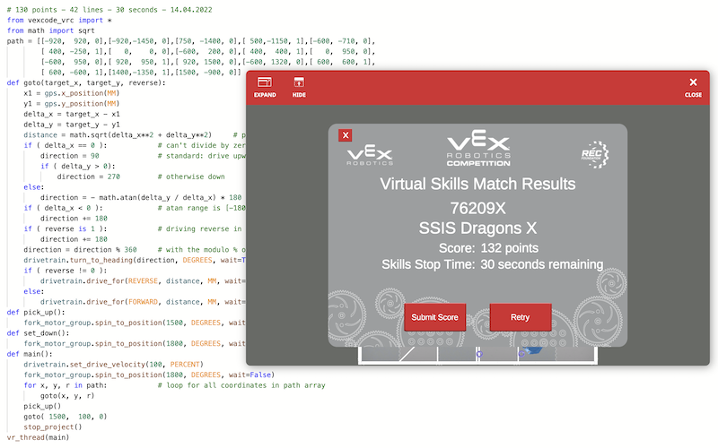

# VEX

[](https://GitHub.com/kreier/vex/releases/)
[](https://kreier.mit-license.org/)

Programs for team 76209 of the SSIS Dragons. Code, functions and highscores constantly improve. The online competition website is https://codev5.vex.com/

## Highscore

- 09/27/2021 43 points
- 10/08/2021 96 points
- 11/01/2021 102 points
- 11/06/2021 111 points
- 11/08/2021 130 points with comments and some structured code
- 12/10/2021 130 points in 30 seconds, new `goto` function, 60 lines
- 04/13/2022 130 points in 30 seconds, but only 42 lines, less code by using an array



## Latest code

``` py
# 130 points - 41 lines - 30 seconds - 15.04.2022
from vexcode_vrc import *
from math import sqrt
path = [[-920,  920, 0],[-920,-1450, 0],[750, -1400, 0],[ 500,-1150, 1],[-600, -710, 0],
        [ 400, -250, 1],[   0,    0, 0],[-600,  200, 0],[ 400,  400, 1],[   0,  950, 0],
        [-600,  950, 0],[ 920,  950, 1],[ 920, 1500, 0],[-600, 1320, 0],[ 600,  600, 1],
        [ 600, -600, 1],[1400,-1350, 1],[1500, -900, 0]]
def goto(target_x, target_y, reverse):
    x1 = gps.x_position(MM)
    y1 = gps.y_position(MM)
    delta_x = target_x - x1
    delta_y = target_y - y1
    direction_fr = FORWARD          # direction either FORWARD or REVERSE fr
    distance = math.sqrt(delta_x**2 + delta_y**2)     # pythagorean theorem
    if ( delta_x == 0 ):            # can't divide by zero, vertical motion
        direction = 90              # standard: drive upwards
        if ( delta_y > 0):
            direction = 270         # otherwise downwards
    else:
        direction = - math.atan(delta_y / delta_x) * 180 / math.pi
    if ( delta_x < 0 ):             # atan range is [-180|180] but need [0|360] 
        direction += 180
    if ( reverse is 1 ):            # driving reverse in opposite direction
        direction += 180
        direction_fr = REVERSE
    direction = direction % 360     # with the modulo % operator, range < 360 
    drivetrain.turn_to_heading(direction, DEGREES, wait=True)   # (1) DIRECTION
    drivetrain.drive_for(direction_fr, distance, MM, wait=True) # (2) DRIVING
def pick_up():
    fork_motor_group.spin_to_position(1500, DEGREES, wait=True)
def set_down():
    fork_motor_group.spin_to_position(1800, DEGREES, wait=True)
def main():
    drivetrain.set_drive_velocity(100, PERCENT)
    fork_motor_group.spin_to_position(1800, DEGREES, wait=False)
    for x, y, r in path:            # loop for all coordinates in path array
        goto(x, y, r)
    pick_up() 
    goto( 1500,  100, 0)
    stop_project()
vr_thread(main)
```

## Historic code

Created December 10th. With the new `goto( x-coordinate, y-coordinate, reverse)` function, using GPS and trigonometry. 

``` py
# 130 points - 60 lines - 30 seconds - 09.12.2021
from vexcode_vrc import *
from math import sqrt

def main():
    drivetrain.set_drive_velocity(100,PERCENT)
    fork_motor_group.spin_to_position(1800, DEGREES, wait=False)
    goto( -920,  920, 0)
    goto( -920,-1450, 0)
    goto(  750,-1400, 0) # blue in right zone
    goto(  500,-1150, 1)
#   goto(    0, -950, 0) # m = - 2/5
    goto( -600, -710, 0) # yellow in left zone
    goto(  400, -250, 1)
    goto(    0,    0, 0) # m = - 5/8
    goto( -600,  200, 0) # yellow in left zone
    goto(  400,  400, 1)
    goto(    0,  950, 0)
    goto( -600,  950, 0) # yellow in left zone
    goto(  920,  950, 1)
    goto(  920, 1500, 0)
    goto( -600, 1320, 0) # red in left zone
    goto(  600,  600, 1)
    goto(  600, -600, 1)
    goto( 1400,-1350, 1)
    goto( 1500, -900, 0) # red on balance
    pick_up() 
    goto( 1500,  100, 0)
    stop_project()

def goto(target_x, target_y, reverse):
    x1 = gps.x_position(MM)
    y1 = gps.y_position(MM)
    delta_x = target_x - x1
    delta_y = target_y - y1
    distance = math.sqrt(delta_x**2 + delta_y**2)     # pythagorean theorem
    if ( delta_x == 0 ):
        if ( delta_y < 0):
            direction = 90
        else:
            direction = 270
    else:
        direction = - math.atan(delta_y / delta_x) * 180 / math.pi
    if ( delta_x < 0 ):
        direction = direction + 180
    if ( reverse != 0 ):
        direction = direction + 180
    if ( direction > 360 ):
        direction = direction - 360
    drivetrain.turn_to_heading(direction, DEGREES, wait=True)
    if ( reverse != 0 ):
        drivetrain.drive_for(REVERSE, distance, MM, wait=True)
    else:
        drivetrain.drive_for(FORWARD, distance, MM, wait=True)
def pick_up():
    fork_motor_group.spin_to_position(1500, DEGREES, wait=True)
def set_down():
    fork_motor_group.spin_to_position(1800, DEGREES, wait=True)

vr_thread(main)
```
