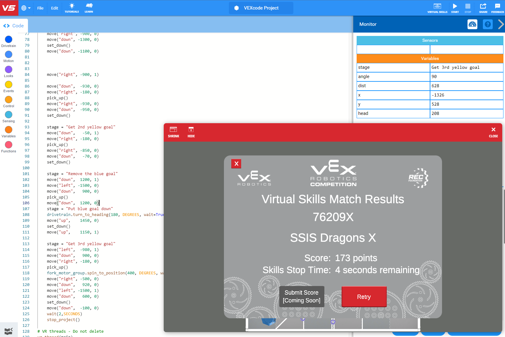
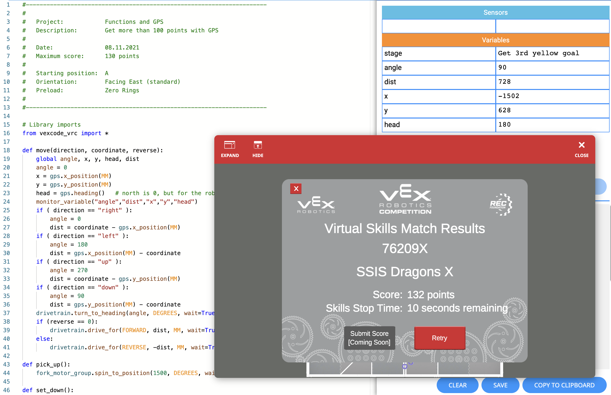

# VEX History

This repository started in September 2021 to document the virtual skills of team 76209 at SSIS, since all teaching was done online due to the ongoing Covid-19 pandemic. Until the end of 2022 no team was allowed to travel, so even a year later we could not visit Taipei for the Signature Event. But by summer 2023 all restrictions were virtually gone, so this repository turned into a little history of VEX at SSIS and in Vietnam. For season 2024-2025 High Stakes there are 4 teams to represent Vietnam at the V5RC World Championship in Dallas, like the year before. Here is a list:

- 2025 High Stakes 1x MS, 3x HS:
- 2024 [Over Under](https://www.robotevents.com/robot-competitions/vex-robotics-competition/RE-VRC-23-3691.html#general-info) 1x MS: [36070A](https://www.robotevents.com/teams/V5RC/36070A) PENN APPLE JUICE, 3x [High School](https://www.robotevents.com/robot-competitions/vex-robotics-competition/RE-VRC-23-3690.html#general-info): [36070M](https://www.robotevents.com/teams/V5RC/36070M) 11, [36070J](https://www.robotevents.com/teams/V5RC/36070J) LSTS FATE, [36070F](https://www.robotevents.com/teams/V5RC/36070F) PENN MÌ Ý
- 2023 [Spin Up](https://www.robotevents.com/robot-competitions/vex-robotics-competition/RE-VRC-22-9726.html#general-info) 1x Middle School: [76209M](https://www.robotevents.com/teams/V5RC/76209M) Mission Impossible , 1x High School: [76209R](https://www.robotevents.com/teams/V5RC/76209R) Raccoons
- 2022 Tipping Point (Covid-19)
- 2021 Change-Up (Covid-19)
- 2020 [Tower Takeover](https://www.robotevents.com/robot-competitions/vex-robotics-competition/RE-VRC-19-8379.html#general-info) 1x High school: [76209G](https://www.robotevents.com/teams/V5RC/76209G)
- 2019 [Turning Point](https://www.robotevents.com/robot-competitions/vex-robotics-competition/RE-VRC-18-6082.html#general-info) 1x High School: [76209X](https://www.robotevents.com/teams/V5RC/76209X)
- 2018 [In the Zone](https://www.robotevents.com/robot-competitions/vex-robotics-competition/RE-VRC-17-3805.html#general-info) 1x High School: [76209G](https://www.robotevents.com/teams/V5RC/76209G)

A little more history for the teams starting with 76209 from 2016 to 2023 at SSIS can be found in [this PDF document](76209_VEX_at_SSIS_2016-2023.pdf) on 85 pages. Starting summer 2023 the new team number is 1599.

## VEX at SSIS for 2021-2022 Tipping Point

[](https://GitHub.com/kreier/vex/releases/)
[](https://kreier.mit-license.org/)
Programs for team 76209X of the SSIS Dragons X. Code, functions and highscores constantly improve.

## Highscore

- 09/27/2021 43 points
- 10/08/2021 96 points
- 11/01/2021 102 points
- 11/06/2021 111 points
- 11/08/2021 130 points
- 11/23/2021 173 points in 57 seconds
- 12/10/2021 130 points in 30 seconds, new `goto` function



## 130 points in just 30 seconds - start of December

Created December 10th. With the new `goto( x-coordinate, y-coordinate, reverse)` function, using GPS and trigonometry. 

``` py
# 130 points - 60 lines - 30 seconds - 09.12.2021
from vexcode_vrc import *
from math import sqrt

def main():
    drivetrain.set_drive_velocity(100,PERCENT)
    fork_motor_group.spin_to_position(1800, DEGREES, wait=False)
    goto( -920,  920, 0)
    goto( -920,-1450, 0)
    goto(  750,-1400, 0) # blue in right zone
    goto(  500,-1150, 1)
#   goto(    0, -950, 0) # m = - 2/5
    goto( -600, -710, 0) # yellow in left zone
    goto(  400, -250, 1)
    goto(    0,    0, 0) # m = - 5/8
    goto( -600,  200, 0) # yellow in left zone
    goto(  400,  400, 1)
    goto(    0,  950, 0)
    goto( -600,  950, 0) # yellow in left zone
    goto(  920,  950, 1)
    goto(  920, 1500, 0)
    goto( -600, 1320, 0) # red in left zone
    goto(  600,  600, 1)
    goto(  600, -600, 1)
    goto( 1400,-1350, 1)
    goto( 1500, -900, 0) # red on balance
    pick_up() 
    goto( 1500,  100, 0)
    stop_project()

def goto(target_x, target_y, reverse):
    x1 = gps.x_position(MM)
    y1 = gps.y_position(MM)
    delta_x = target_x - x1
    delta_y = target_y - y1
    distance = math.sqrt(delta_x**2 + delta_y**2)     # pythagorean theorem
    if ( delta_x == 0 ):
        if ( delta_y < 0):
            direction = 90
        else:
            direction = 270
    else:
        direction = - math.atan(delta_y / delta_x) * 180 / math.pi
    if ( delta_x < 0 ):
        direction = direction + 180
    if ( reverse != 0 ):
        direction = direction + 180
    if ( direction > 360 ):
        direction = direction - 360
    drivetrain.turn_to_heading(direction, DEGREES, wait=True)
    if ( reverse != 0 ):
        drivetrain.drive_for(REVERSE, distance, MM, wait=True)
    else:
        drivetrain.drive_for(FORWARD, distance, MM, wait=True)
def pick_up():
    fork_motor_group.spin_to_position(1500, DEGREES, wait=True)
def set_down():
    fork_motor_group.spin_to_position(1800, DEGREES, wait=True)

vr_thread(main)
```

## Almost 200 points at the end of November

Here is the code to reach this score:

``` py
#----------------------------------------------------------------------
#   
#   Project:            Get Red home
#   Description:        Both goals in red home zone
#                       
#   Date:               23.11.2021
#   Maximum score:      172 points
#   Time left:          4 seconds
#
#   Starting position:  A
#   Orientation:        Facing East (standard)
#   Preload:            Zero Rings
#
#----------------------------------------------------------------------

# Library imports
from vexcode_vrc import *

def move(direction, coordinate, reverse):
    global angle, x, y, head, dist
    angle = 0
    x = gps.x_position(MM)
    y = gps.y_position(MM)
    head = gps.heading()   # north is 0, but for the robot 0 is east - from start    
    monitor_variable("angle","dist","x","y","head") 
    if ( direction == "right" ):
        angle = 0
        dist = coordinate - gps.x_position(MM)
    if ( direction == "left" ):
        angle = 180
        dist = gps.x_position(MM) - coordinate
    if ( direction == "up" ):
        angle = 270
        dist = coordinate - gps.y_position(MM)
    if ( direction == "down" ):
        angle = 90
        dist = gps.y_position(MM) - coordinate
    drivetrain.turn_to_heading(angle, DEGREES, wait=True)
    if (reverse == 0):
        drivetrain.drive_for(FORWARD, dist, MM, wait=True)
    else:
        drivetrain.drive_for(REVERSE, -dist, MM, wait=True)

def pick_up():
    fork_motor_group.spin_to_position(1500, DEGREES, wait=True)

def set_down():
    fork_motor_group.spin_to_position(1800, DEGREES, wait=True)

# Add project code in "main"
def main():
    global stage
    stage = "Initiate system"
    monitor_variable("stage")
    drivetrain.set_drive_velocity(100,PERCENT)

    fork_motor_group.spin_to_position(1800, DEGREES, wait=False)
    move("right", -920, 0)
    stage = "Pick up red goal 1"    
    move("up",    1500, 0)
    move("right",  920, 0)    
    pick_up()
    move("left", -1500, 0)
    move("up",    1450, 0)
    set_down()
    move("up",    1150, 1)

    stage = "Pick up red goal 2"    
    move("right", -950, 0)
    move("down",  -500, 0)
    move("right",  950, 0)
    move("down", -1150, 0)
    move("right", 1500, 0)
    move("up",    -900, 0)
    pick_up()
    move("up",   -1200, 0)
    move("right", -900, 0)
    move("down", -1300, 0)
    set_down()
    move("down", -1100, 0)


    move("right", -900, 1)

    move("down",  -930, 0)
    move("right", -180, 0)
    pick_up()
    move("right", -930, 0)
    move("down",  -950, 0)
    set_down()

    stage = "Get 2nd yellow goal"
    move("down",   -50, 1)
    move("right", -180, 0)
    pick_up()
    move("right", -850, 0)
    move("down",   -70, 0)
    set_down()

    stage = "Remove the blue goal"
    move("down",  1200, 1)
    move("left", -1500, 0)
    move("down",   900, 0)
    pick_up()
    move("down",  1200, 0)
    stage = "Put blue goal down"
    drivetrain.turn_to_heading(180, DEGREES, wait=True)
    move("up",    1450, 0)
    set_down()
    move("up",    1150, 1)
 
    stage = "Get 3rd yellow goal"
    move("left",  -980, 1)
    move("down",   900, 0)
    move("right", -180, 0)
    pick_up()
    fork_motor_group.spin_to_position(400, DEGREES, wait=False)
    move("right", -500, 0)
    move("down",   920, 0)
    move("left", -1500, 1)
    move("down",   600, 0)
    set_down()
    move("down",  -100, 0)
    wait(2,SECONDS)
    stop_project()

# VR threads - Do not delete
vr_thread(main)
```

## Code from November 8th, 2021



Finally with a function to easier maintain the code and improve readability. The new `move(direction, coordinate, reverse)` function was created and used for the following 4 weeks.

Possible update: rewrite the `move` function to `move( x-coordinate, y-coordinate, reverse)` and adjust the direction with starting position (GPS) and trigonometry. And then add more locations within one minute.

``` py
----------------------------------------------------------------------
#   
#   Project:            Calling GPS functions
#   Description:        Get more than 100 points with GPS
#                       Driving style: drive, check, correct
#   Date:               08.11.2021
#   Maximum score:      130 points
#   Time left:          10 seconds
#
#   Starting position:  A
#   Orientation:        Facing East (standard)
#   Preload:            Zero Rings
#
#----------------------------------------------------------------------

# Library imports
from vexcode_vrc import *

def move(direction, coordinate, reverse):
    global angle, x, y, head, dist
    angle = 0
    x = gps.x_position(MM)
    y = gps.y_position(MM)
    head = gps.heading()   # north is 0, but for the robot 0 is east - from start    
    monitor_variable("angle","dist","x","y","head") 
    if ( direction == "right" ):
        angle = 0
        dist = coordinate - gps.x_position(MM)
    if ( direction == "left" ):
        angle = 180
        dist = gps.x_position(MM) - coordinate
    if ( direction == "up" ):
        angle = 270
        dist = coordinate - gps.y_position(MM)
    if ( direction == "down" ):
        angle = 90
        dist = gps.y_position(MM) - coordinate
    drivetrain.turn_to_heading(angle, DEGREES, wait=True)
    if (reverse == 0):
        drivetrain.drive_for(FORWARD, dist, MM, wait=True)
    else:
        drivetrain.drive_for(REVERSE, -dist, MM, wait=True)

def pick_up():
    fork_motor_group.spin_to_position(1500, DEGREES, wait=True)

def set_down():
    fork_motor_group.spin_to_position(1800, DEGREES, wait=True)

# Add project code in "main"
def main():
    global stage
    stage = "Initiate system"
    monitor_variable("stage")
    drivetrain.set_drive_velocity(60,PERCENT)

    stage = "Get 1st yellow goal"
    fork_motor_group.spin_to_position(1800, DEGREES, wait=False)
    move("right", -920, 0)
    move("down", -1300, 0)
    pick_up()
    move("right", 1000, 0)
    set_down()
    move("right", -900, 1)

    move("down",  -930, 0)
    move("right", -180, 0)
    pick_up()
    move("right", -930, 0)
    move("down",  -950, 0)
    set_down()

    stage = "Get 2nd yellow goal"
    move("down",   -50, 1)
    move("right", -180, 0)
    pick_up()
    move("right", -850, 0)
    move("down",   -70, 0)
    set_down()

    stage = "Remove the blue goal"
    move("down",  1200, 1)
    move("left", -1500, 0)
    move("down",   900, 0)
    pick_up()
    move("down",  1200, 0)
    stage = "Put blue goal down"
    drivetrain.turn_to_heading(180, DEGREES, wait=True)
    move("up",    1450, 0)
    set_down()
    move("up",    1150, 1)
 
    stage = "Get 3rd yellow goal"
    move("left",  -980, 1)
    move("down",   900, 0)
    move("right", -180, 0)
    pick_up()
    fork_motor_group.spin_to_position(400, DEGREES, wait=False)
    move("right", -500, 0)
    move("down",   920, 0)
    move("left", -1500, 1)
    move("down",   600, 0)
    set_down()
    move("down",  -100, 0)
    stop_project()

# VR threads - Do not delete
vr_thread(main)
```

## Finally

More code and older attempts starting September 2021 are in the Github project page.

